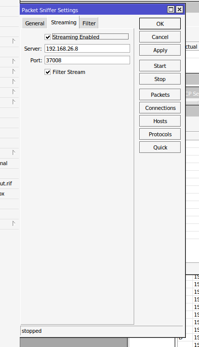

# tzsp-tap-service

Receives a [TZSP](https://en.wikipedia.org/wiki/TZSP) (TaZmen Sniffer
Protocol) packet stream from a MikroTik RouterOS device's packet sniffer
and injects the raw Ethernet frames into a local `tap0` interface — no
extra software needed on the router itself, RouterOS mirrors traffic to
this service natively.

Built to feed a Snort/Suricata IDS research pipeline
([Mata Elang](https://github.com/mata-elang-stable) —
[mata-elang-pens](https://github.com/mata-elang-pens)) that needs every
real packet on a host interface, not a summary or a sample.

## How it works

- `tzsp-tap` (Python, stdlib only) binds UDP `37008` (RouterOS's default
  TZSP streaming port), strips the TZSP header and tag-list from each
  datagram, and writes the raw Ethernet frame straight into a `tap0` TAP
  device via the `TUNSETIFF`/`IFF_TAP` ioctl. The interface is brought up
  with `promisc on` so downstream tools (Snort, Suricata, `tcpdump`) see
  everything.
- Packaged as a root-run systemd service (`Restart=always`) so it
  survives crashes and reboots.
- `install.sh` also builds and installs
  [`tzsp2pcap`](https://github.com/thefloweringash/tzsp2pcap), a small
  companion tool that dumps the same TZSP stream straight to a `.pcap`
  file for offline inspection in Wireshark — useful for one-off
  debugging without needing `tap0` at all.

```
MikroTik router --TZSP/UDP:37008--> tzsp-tap --> tap0 (promisc, up)
                                                    │
                                          Snort / Suricata / tcpdump
```

## Requirements

- Linux with `/dev/net/tun` available
- Python 3 (stdlib only, no dependencies)
- Root (TAP device creation and systemd service installation both need
  it)
- `git`, `make`, `gcc`, `libpcap-dev` — only needed for the bundled
  `tzsp2pcap` build

## How to implement

### 1. Install the service (server side)

On the Linux host that will receive the TZSP stream and own `tap0`:

```bash
sudo ./install.sh
```

This builds and installs `tzsp2pcap` to `/usr/local/bin`, installs
`tzsp-tap` to `/usr/local/bin`, installs and enables the `tzsp-tap`
systemd service, and starts it.

Check it's running:

```bash
sudo systemctl status tzsp-tap
ip link show tap0
```

`tap0` should show `UP` and `PROMISC` in its flags.

### 2. Point the router's sniffer at it

On the MikroTik device, either via CLI:

```
/tool sniffer set streaming-enabled=yes streaming-server=<this-host-ip>:37008
/tool sniffer start
```

or the WinBox GUI, under **Tools → Packet Sniffer → Streaming**: check
**Streaming Enabled**, set **Server** to this host's IP and **Port** to
`37008`, then **Apply**/**OK** and **Start** the sniffer.



**Filter Stream** (checked above, on the **Filter** tab) is optional —
enable it to restrict what gets mirrored (by interface, address, port,
etc.) if you don't want the router streaming *all* traffic it sees.

### 3. Verify traffic is flowing

```bash
sudo tcpdump -i tap0 -c 10
```

You should see live frames matching what the router is sniffing. If
nothing appears: confirm the router's sniffer status is `running` (not
`stopped`, as in the screenshot above before **Start** is pressed),
check `sudo journalctl -u tzsp-tap -f` for parse/write errors, and make
sure UDP `37008` isn't blocked between the router and this host.

## Uninstall

```bash
sudo ./uninstall.sh
```

Stops and disables the service, and removes the installed binaries and
service file.

## Status

This service is being superseded by
[alfiyansys/tzsp-packet-sensor](https://github.com/alfiyansys/tzsp-packet-sensor),
a Go rewrite that adds a second, concurrent consumer (live topology
reporting into [Scope](https://github.com/alfiyansys/scope)) alongside
the same `tap0` injection behavior this service provides today. This
repo remains the reference implementation and the production service
until that cutover is validated side-by-side and complete.
